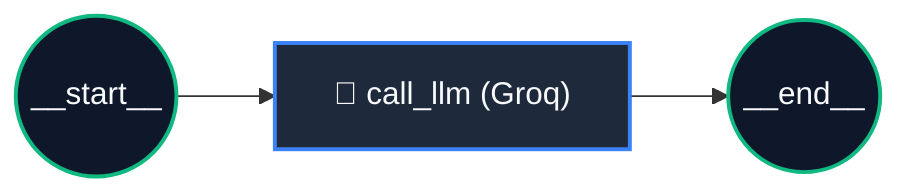
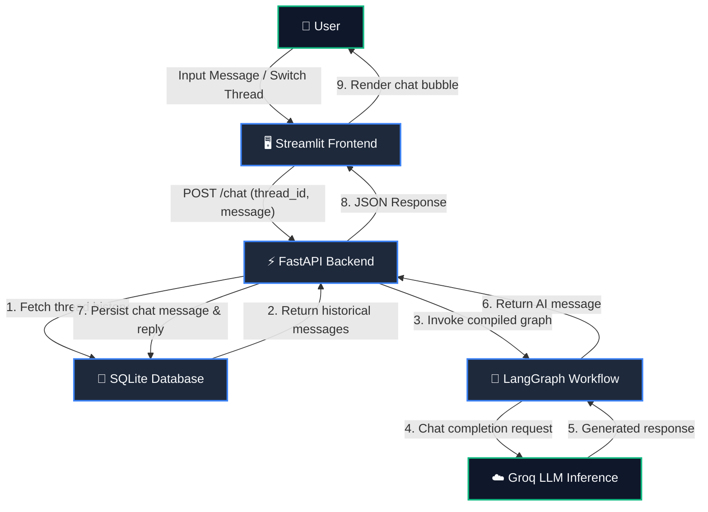

# 🤖 AI ChatBot with LangGraph, FastAPI & Streamlit

[](https://github.com/langchain-ai/langgraph)
[](https://github.com/langchain-ai/langchain)
[](https://groq.com/)
[](https://fastapi.tiangolo.com/)
[](https://streamlit.io/)
[](https://www.sqlalchemy.org/)
[](https://www.python.org/)

---

## 🎬 Demo Video

https://github.com/user-attachments/assets/6a65300d-9588-4204-9164-c078e9f828ca

---

## 📌 Project Overview

**AI ChatBot** is a stateful conversational AI system built using **LangGraph**, **FastAPI**, **Streamlit**, and **Groq Cloud**. 

Unlike stateless chatbots that forget context between interactions, this system maintains multi-turn conversation memory organized by persistent **Thread IDs**. Conversations are automatically stored in an **SQLite** database via **SQLAlchemy**, allowing users to seamlessly start new conversations, switch between previous threads, and retrieve past chat history on demand.

---

## ✨ Key Features

- **⚡ High-Speed LLM Inference**: Integrated with **Groq Cloud** using state-of-the-art open models (default: `qwen/qwen3.8-27b`) for ultra-low latency responses.
- **🧠 Graph-Based Agent Orchestration**: Powered by **LangGraph** with a compiled `StateGraph` and `MessagesState` message pipeline.
- **💾 Persistent Thread Storage**: Automatically persists all user messages, assistant replies, and timestamps to **SQLite** using **SQLAlchemy** ORM.
- **🧵 Multi-Thread Conversation Management**: Supports isolated conversation threads with unique thread IDs.
- **🔄 Instant Thread Switching**: Browse and reload past conversation threads directly from the sidebar with full conversation context restored.
- **🌐 Decoupled RESTful Architecture**: Clean separation between a high-performance **FastAPI** backend and an interactive **Streamlit** frontend.
- **📖 Interactive API Documentation**: Auto-generated interactive Swagger UI available at `/docs`.

---

## 🧠 System Architecture & Workflow

### 1. LangGraph Core Execution Graph



### 2. End-to-End System Flow



---

## 🛠️ Detailed Tech Stack

| Component | Technology | Description |
| :--- | :--- | :--- |
| **Agentic Orchestration** | [LangGraph](https://github.com/langchain-ai/langgraph) | State graph orchestration, state management with `MessagesState`, and graph compilation. |
| **LLM Framework** | [LangChain](https://github.com/langchain-ai/langchain) | Message schemas (`human`, `ai`, `system`), prompt formatting, and LLM abstractions. |
| **LLM Inference Engine** | [ChatGroq](https://groq.com/) | Ultra-fast cloud inference powering model execution (configurable via `GROQ_MODEL`). |
| **Backend REST API** | [FastAPI](https://fastapi.tiangolo.com/) | Asynchronous web framework exposing endpoints for chatting, listing threads, and retrieving history. |
| **ASGI Server** | [Uvicorn](https://www.uvicorn.org/) | Production-grade ASGI server for hosting the FastAPI application. |
| **Database & ORM** | [SQLAlchemy](https://www.sqlalchemy.org/) + [SQLite](https://www.sqlite.org/) | Relational database schema (`CHATTable`) for persistent storage of thread messages and timestamps. |
| **Frontend UI** | [Streamlit](https://streamlit.io/) | Interactive chat interface featuring thread switching, session state handling, and conversation viewing. |
| **Data Validation** | [Pydantic](https://docs.pydantic.dev/) | Request body validation for chat messages (`ChatRequest`). |
| **Environment Config** | [python-dotenv](https://github.com/theskumar/python-dotenv) | Environment variable configuration (`GROQ_API_KEY`, `DB_URL`, `BACKEND_URL`). |

---

## 📂 Project Structure

```text
ChatBot/
├── backend/
│   ├── __init__.py
│   ├── chatbot_core.py        # LangGraph workflow definition & Groq LLM setup
│   ├── chatbot_fastapi.py     # FastAPI REST API endpoints (/chat, /threads, history)
│   └── chatbot_graph.png      # Exported diagram of the LangGraph workflow
├── database/
│   ├── __init__.py
│   ├── chat_database.py       # SQLAlchemy ORM models, session management & queries
│   └── chat_database.db       # SQLite database file (stores conversation threads)
├── frontend/
│   └── app.py                 # Streamlit web interface with thread switching
├── .env                       # Environment variables (API keys & configuration)
├── .gitignore                 # Excludes .venv, __pycache__, .env, and local artifacts
├── LICENSE                    # MIT License
├── README.md                  # Comprehensive project documentation
└── requirements.txt           # Python project dependencies
```

---

## 🚀 Getting Started (Local Setup)

### 1. Prerequisites

- **Python `3.10` or higher** installed
- A **Groq API Key** ([Get a free key from Groq Console](https://console.groq.com/keys))

### 2. Clone Repository & Setup Virtual Environment

```bash
# Clone the repository
git clone https://github.com/your-username/ChatBot.git
cd ChatBot

# Create and activate virtual environment
# Windows (PowerShell):
python -m venv .venv
.\.venv\Scripts\Activate.ps1

# macOS / Linux:
python3 -m venv .venv
source .venv/bin/activate
```

### 3. Install Dependencies

```bash
pip install -r requirements.txt
```

### 4. Configure Environment Variables

Create a `.env` file in the root directory:

```env
GROQ_API_KEY=your_groq_api_key_here
GROQ_MODEL=qwen/qwen3.8-27b
DB_URL=sqlite:///database/chat_database.db
BACKEND_URL=http://127.0.0.1:8000
```

---

## 🖥️ Running the Application

To run the full-stack system, launch the backend server and frontend client in separate terminal windows:

### Step 1: Start the FastAPI Backend
In your first terminal window:

```bash
uvicorn backend.chatbot_fastapi:app --reload --port 8000
```

- **API Server:** `http://127.0.0.1:8000`
- **Interactive Swagger Docs:** `http://127.0.0.1:8000/docs`
- **Alternative Redoc:** `http://127.0.0.1:8000/redoc`

### Step 2: Start the Streamlit Frontend
In your second terminal window:

```bash
streamlit run frontend/app.py
```

- **Web Interface:** `http://localhost:8501`

---

## 📡 API Endpoints

| Method | Endpoint | Description | Request Body / Parameters |
| :--- | :--- | :--- | :--- |
| `GET` | `/` | Health check & API status. | None |
| `POST` | `/chat` | Processes user message through LangGraph & saves chat. | `{"thread_id": "string", "message": "string"}` |
| `GET` | `/threads` | Retrieves list of all unique thread IDs. | None |
| `GET` | `/threads/{thread_id}` | Fetches complete conversation history for a given thread. | `thread_id` (path parameter) |
| `GET` | `/docs` | Interactive Swagger API documentation. | None |

---

## 📜 License

Licensed under the [MIT License](LICENSE).
